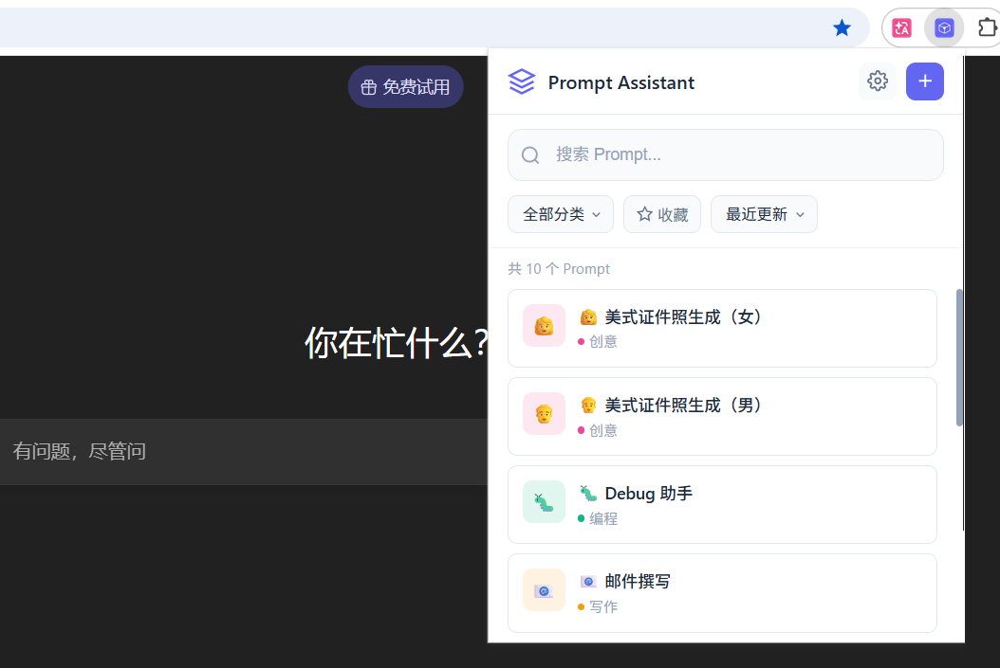
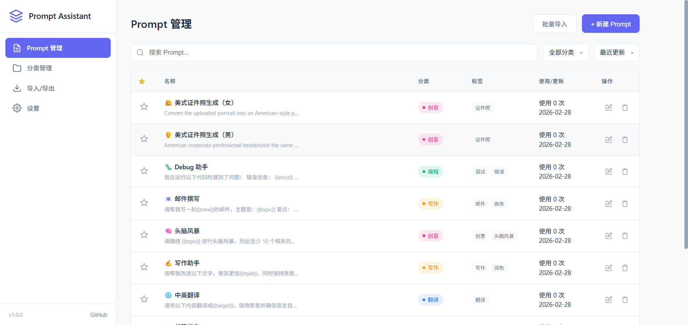

# Prompt Assistant - 提示词插件

一款专为提升大模型使用效率而设计的 Chrome 浏览器插件。管理和快速插入常用 Prompt，支持 ChatGPT、Claude、Gemini、Kimi 等主流 AI 平台。


## ✨ 功能特性

### 核心功能
- 📝 **自定义 Prompt 存储** - 创建、编辑、删除你的常用 Prompt
- 🏷️ **标签系统** - 使用标签组织大量 Prompt
- 🔍 **智能搜索** - 支持名称、内容、标签的全文搜索
- ⚡ **一键插入** - 点击即可将 Prompt 插入到 AI 平台的输入框
- ⭐ **收藏功能** - 标记常用的 Prompt 方便快速访问

### 数据管理
- 📤 **导入/导出** - 支持 JSON 格式备份和分享
- 📋 **批量导入** - 支持多格式批量添加 Prompt
- 📊 **使用统计** - 追踪每个 Prompt 的使用频率

### 平台支持
支持自动插入 Prompt 的平台：
- ChatGPT (chat.openai.com / chatgpt.com)
- Claude (claude.ai)
- Gemini (gemini.google.com)
- Kimi (kimi.moonshot.cn / kimi.com)
- 通义千问 (tongyi.aliyun.com)
- 文心一言 (yiyan.baidu.com)
- 讯飞星火 (xinghuo.xfyun.cn)
- 豆包 (doubao.com)
- ChatGLM (chatglm.cn)
- Poe (poe.com)
- Copilot (copilot.microsoft.com)

对于不支持的网站，插件会自动将 Prompt 复制到剪贴板。

## 🚀 安装方法

### 开发者模式安装（推荐）

1. **下载代码**
   ```bash
   git clone https://github.com/hydrogenhy/prompt-plugin-Chrome.git
   ```
   或直接下载 ZIP 并解压

2. **打开 Chrome 扩展管理页面**
   - 在 Chrome 地址栏输入 `chrome://extensions/`
   - 或点击菜单 → 更多工具 → 扩展程序

3. **开启开发者模式**
   - 点击右上角的「开发者模式」开关

4. **加载扩展**
   - 点击「加载已解压的扩展程序」
   - 选择 `prompt-assistant` 文件夹

5. **完成**
   - 插件图标将出现在浏览器工具栏
   - 点击图标即可使用

### 快捷键
- **默认**: `Alt+P` - 快速打开 Prompt Assistant

#### 自定义快捷键
1. 右键插件图标 → 选项 → 设置
2. 点击「自定义快捷键」按钮
3. 或在 Chrome 地址栏输入 `chrome://extensions/shortcuts`
4. 找到 Prompt Assistant，点击修改快捷键
5. 按下你想要的组合键（如 `Ctrl+Shift+A`、`Alt+S` 等）

> 💡 支持的快捷键格式：
> - `Alt` + 字母/数字
> - `Ctrl` + 字母/数字  
> - `Ctrl+Shift` + 字母/数字
> - `Alt+Shift` + 字母/数字
> - 功能键如 `F1` ~ `F12`

## 📖 使用指南

### 添加 Prompt
1. 点击插件图标打开弹窗
2. 点击右上角的「+」按钮
3. 填写名称、选择分类、输入内容
4. 点击保存

### 使用 Prompt
1. 在任意支持的 AI 平台打开聊天页面
2. 点击插件图标或使用快捷键 `Alt+P` 打开弹窗
3. 搜索或浏览找到需要的 Prompt
4. 点击 Prompt 名称，内容将自动插入到输入框

### ⭐ 收藏 Prompt
- 在 Prompt 列表中点击星形按钮收藏/取消收藏
- 收藏后可在预览窗口中再次点击星形按钮取消收藏
- 使用「收藏」过滤按钮只显示已收藏的 Prompt

### 导入/导出
1. 右键点击插件图标，选择「选项」打开设置页面
2. 切换到「导入/导出」标签
3. 选择导出备份或导入文件

### 默认 Prompt 配置
插件安装时会自动加载 `data/default-prompts.json` 中的默认 Prompt。你可以通过修改此文件来自定义默认 Prompt（当然直接从插件上添加即可，没必要修改这个文件）：

1. 打开 `prompt-assistant/data/default-prompts.json`
2. 修改 `categories` 数组定义分类（名称和颜色）
3. 修改 `prompts` 数组定义默认 Prompt
4. 保存文件并重新加载扩展

```json
{
  "categories": [
    { "name": "编程", "color": "#10b981" }
  ],
  "prompts": [
    {
      "name": "代码解释",
      "content": "请解释以下代码...",
      "category": "编程",
      "tags": ["编程", "解释"]
    }
  ]
}
```

### 批量导入格式
支持以下格式批量导入：

```
{
  "prompts": [
    {
      "name": "⭐ name",
      "content": "Prompt here",
      "category": "xxx",
      "tags": [
        "xxxxx"
      ],
      "favorite": false
    },
   ],
  "categories": [
    {
      "name": "xxx",
      "color": "#ec4899"
    }
  ]
}
```

## 🛠️ 开发

### 项目结构
```
prompt-assistant/
├── manifest.json          # 扩展配置文件
├── icons/                 # 图标文件
├── popup/                 # 弹出窗口
│   ├── popup.html
│   ├── popup.css
│   └── popup.js
├── options/               # 设置页面
│   ├── options.html
│   ├── options.css
│   └── options.js
├── content/               # 内容脚本
│   └── content.js
├── background/            # 后台脚本
│   └── background.js
└── common/                # 公共模块
    └── storage.js
```

### 技术栈
- Manifest V3
- 原生 JavaScript (ES6+)
- Chrome Extension APIs
- Local Storage

## 📝 变量占位符

在 Prompt 内容中可以使用 `{{变量名}}` 作为占位符，例如：

```
请解释以下代码：
```
{{code}}
```

目标语言：{{target}}
```

使用时只需替换相应的内容即可。

## 🔒 隐私说明

- 所有数据存储在浏览器本地，不会上传到任何服务器
- 插件仅在支持的 AI 网站运行
- 不会收集用户的对话内容

## 📄 许可证

MIT License

## 🤝 贡献

欢迎提交 Issue 和 Pull Request！

也欢迎提交您收集的Prompt（单条 或者 可导入的json文件）

## 🎆 致谢

Thanks for Kimi Code. Made with ❤️ for AI enthusiasts

---

